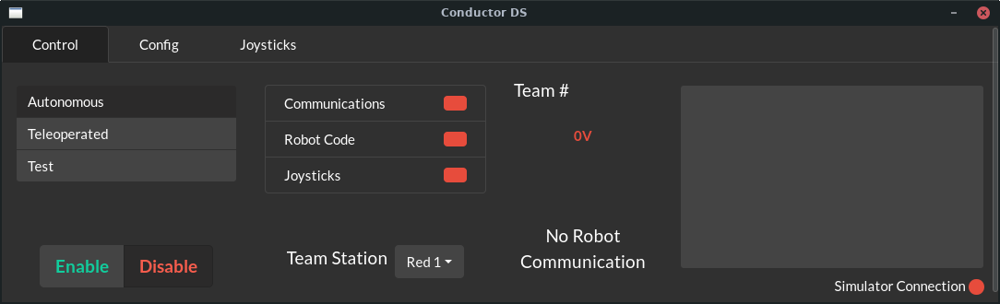
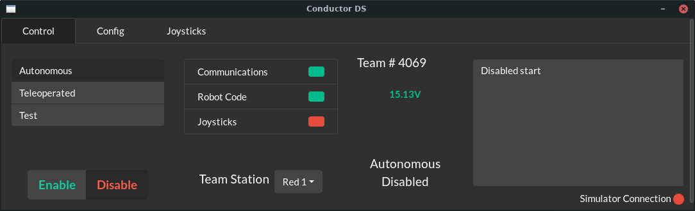
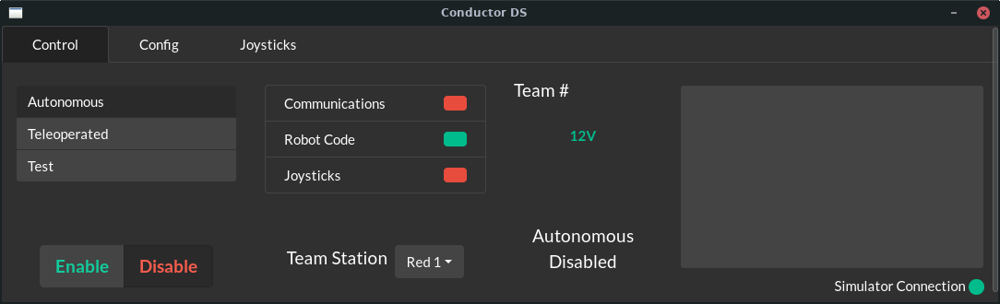
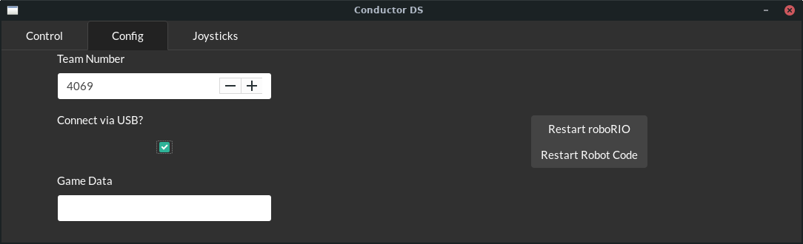
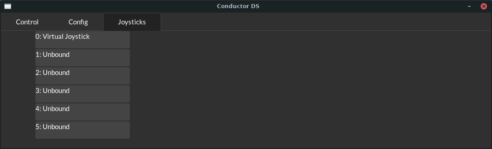

# Conductor: A cross-platform FRC Driver Station

Conductor is a Driver Station for FRC robots for Linux and macOS which supports nearly* every feature of the NI Driver Station.

*Conductor cannot yet auto-launch dashboards, and is not and will never be compatible with the Field Management System. 

# Building

Before building, ensure that you have the following dependencies installed:

- A Rust toolchain (e.g. installed via [Rustup](https://rustup.rs))
- [NodeJS](https://nodejs.org) with NPM
- [WebKitGTK](https://webkitgtk.org/)

Building a release build of Conductor is simple; after cloning the repository run `make setup && make release` to install all the dependencies of the react applications, and then compile both the React apps and the Rust backend into a single executable. When this process is completed, you can find the compiled driver station at `target/release/conductor`. 

# Prebuilt Artifacts

Some artifacts are built and saved automatically by Github Actions. These artifacts can be found published under the Build Status action for the `next` branch.  The artifacts that can be downloaded [here](https://github.com/Redrield/Conductor/actions/workflows/ci.yml?query=branch%3Anext) (Click the link, select the top result, and scroll down to the bottom section that says "artifacts") are:

* A normal x86_64 Linux executable, compiled on Ubuntu
* An x86_64 .deb file
* An x86_64 .rpm file
* An x86_64 macOS .app file (This is compressed in a tarball to preserve permissions)

If desired, these artifacts can be downloaded and installed rather than having to build the project manually.

# Contributing

Building debug builds is almost as simple, after initially cloning run `make setup && make all` to compile both the react apps and the Rust app once. Afterwards, assuming you're only changing the Rust app you can use `cargo run` to skip the compile time of the react apps. If you're changing the main window as well you can use `make` to only recompile the main window as well as the Rust app. 

# Usage

Conductor is designed to emulate the design of the NI Driver Station as closely as possible. The main window is split into three sections, Control, Config, and Joysticks, while the second window serves as a larger viewport to see riolog messages.

## Control Tab

*The control tab of Conductor when not connected to a robot*

*The control tab of Conductor when connected to a robot*

The control tab is very similar to the equivalent tab in the NI Driver Station. On the far left are selectors for the mode, and buttons to enable or disable the robot. In the middle there are boxes indicating connection status, voltage, team number, and current operating mode. On the right is the smaller stdout viewport for seeing messages from riolog.

Underneath the stdout window is one final indicator which shows simulator connection. This indicator is normally red, including when connected to a physical robot. It lights up green when Conductor is connected to a simulator instance on the local machine. 

*The control tab of Conductor with a connection to the WPILib Simulator*

## Config

The second tab in the main window is for configuring functions that only need to be set once, such as team number, and game data.

The first accessible field is the team number field. This will update the number displayed in the control tab, and will also configure the IP to which Conductor will try to connect. The target IP is the familiar 10.TE.AM.2 IP, filled in with the value provided.

The "Connect via USB?" checkbox enables users to override the team number IP and connect to `172.22.11.2` if they have connected to the RIO over USB in a way that allows them to use this interface.

The game data field can be used to update the Game Specific Message given to robot code. This can be used similar to the NI Driver Station to test code that uses this message, such as control panel code in Infinite Recharge.

On the right side are buttons to restart user code, and reboot the roboRIO. These function as they do in the NI Driver Station.

## Joysticks

The final tab is the most sparse, and allows users to configure their joystick mappings. The list visible in this tab is drag and drop, and will update the joystick mappings as they are reordered. The first entry in this map is the Virtual Joystick, which can be used to silence WPILib warnings about unplugged joysticks should it be desired. As joysticks are detected by Conductor, they will be added to this list, replacing "Unbound" entries as required.
